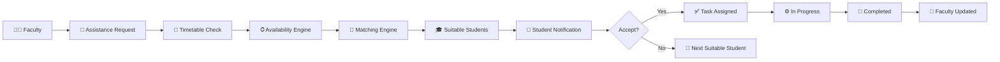
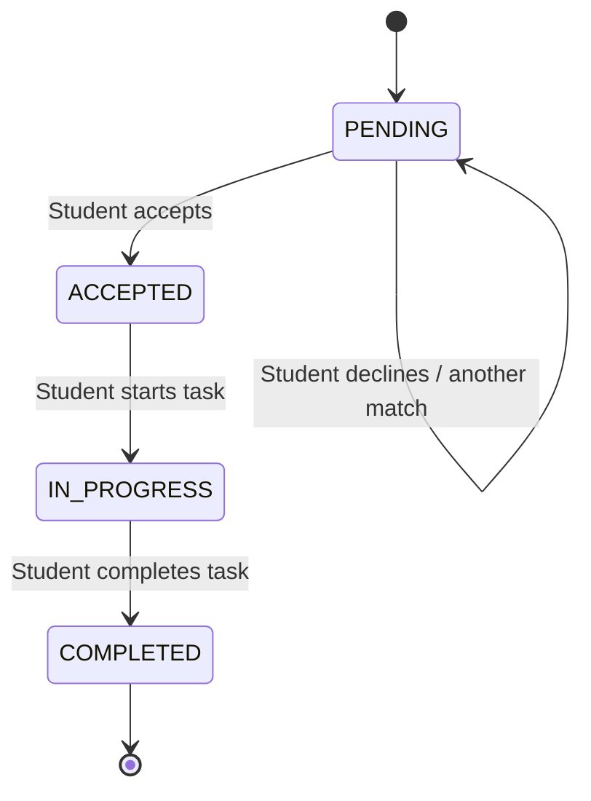
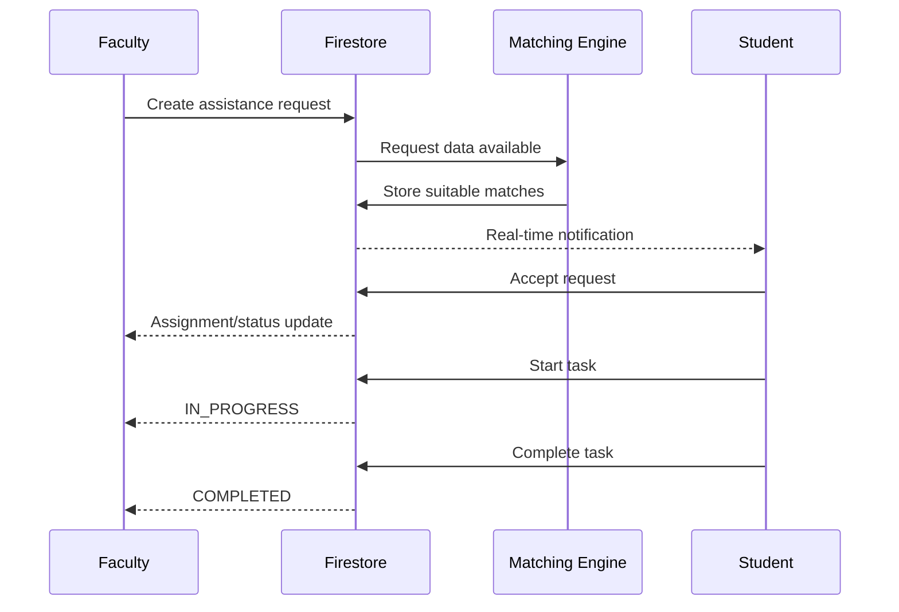
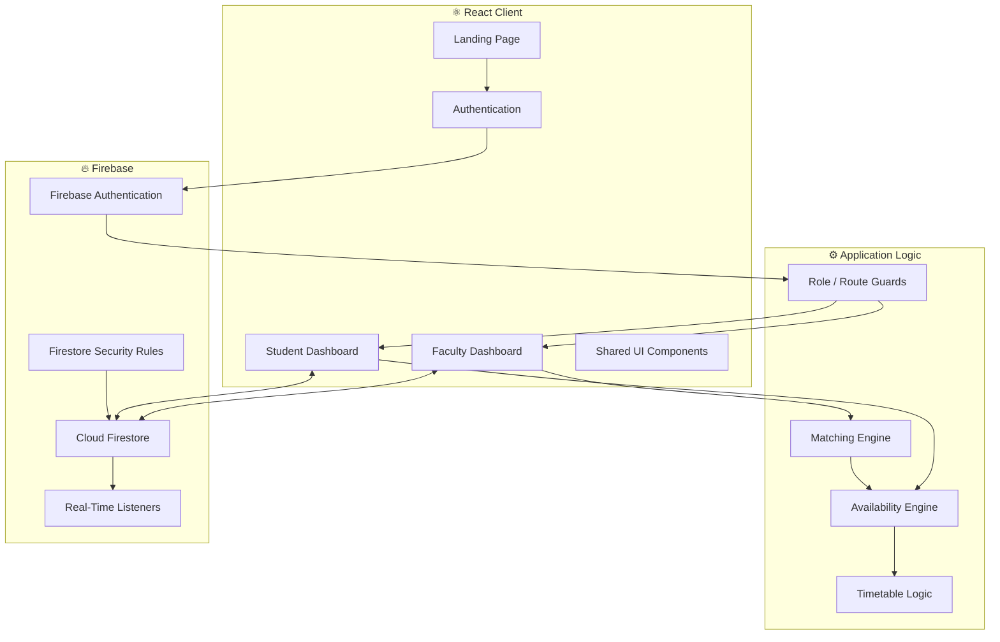
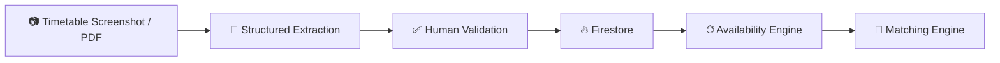

<div align="center">

# 🎓 CAMPUS CONNECT

### Faculty ↔ Student Assistant Coordination, Reimagined

**A smart assistance-management platform built for Sri Guru Gobind Singh College of Commerce, University of Delhi.**

*Find the right student. At the right time. For the right task.*

<br/>


<br/>

**Built for SGGSCC · University of Delhi**

</div>

---

## ⚡ What is Campus Connect?

**Campus Connect** is a faculty–student assistant coordination platform designed around a real operational problem at **Sri Guru Gobind Singh College of Commerce (SGGSCC)**.

A relatively small group of student assistants may need to support a much larger faculty body.

The difficult question is not simply:

> "Which student can help?"

It is:

> **"Which suitable student is actually available for this task, at this time, without a timetable or workload conflict?"**

Campus Connect turns that manual coordination process into a structured workflow.

Faculty members can create assistance requests, while the system evaluates student availability, timetable constraints, skills, workload and suitability to identify appropriate assistants.

Students receive requests, accept or decline them, manage active tasks, and update task progress — while both sides stay synchronized through Firebase.

---

## 🎯 The Problem

Without a centralized system, faculty assistance coordination can quickly become dependent on:

- WhatsApp messages
- individual phone calls
- manually checking student schedules
- asking multiple students who is free
- remembering existing assignments
- manually tracking whether work was accepted or completed

This becomes increasingly inefficient when approximately **40–50 faculty members** may depend on a pool of only around **9 authorized student assistants**.

Campus Connect is designed to replace this fragmented process with a single operational platform.

---

## 💡 The Core Idea

Instead of maintaining a simple list of students, Campus Connect models the complete assistance workflow.



The objective is not to make AI decide everything.

Deterministic constraints such as **time conflicts and timetable availability are handled by application logic**, while intelligent matching can operate on top of reliable structured data.

---

# ✨ Core Features

## 👩‍🏫 Faculty Experience

Faculty members can:

- Sign in through a protected faculty account
- Access a dedicated faculty dashboard
- Create structured assistance requests
- Define task requirements
- Specify preferred date and time
- Specify required skills
- View suitable student assistants
- View availability-aware recommendations
- Track pending requests
- See assigned students
- Monitor task progress
- Receive status updates
- Access request history

---

## 🎓 Student Assistant Experience

Authorized student assistants can:

- Access a protected student dashboard
- View timetable-aware availability
- Receive incoming assistance requests
- Accept or decline requests
- View assigned tasks
- Start accepted tasks
- Mark work as completed
- Track current workload
- View task history
- Receive real-time notifications
- Maintain relevant profile and skill information

Student access is intentionally restricted to the authorized assistant pool rather than every college student.

---

## 📅 Timetable-Aware Availability

A major part of Campus Connect is its availability engine.

A student is **not considered available simply because they are logged in**.

Campus Connect can reason about:

```text
College Timetable
        +
Existing Tasks
        +
Requested Time
        ↓
Actual Availability
```

For example:

```text
Faculty needs assistance:
2:00 PM ───────────── 3:00 PM

Student A:
Free 2:00 PM ── 2:30 PM
❌ Cannot cover complete duration

Student B:
Free 2:00 PM ───────────── 3:30 PM
✅ Can cover complete duration

Result:
Student B is the stronger availability match.
```

Continuous availability matters.

Two separate 30-minute free intervals do **not** automatically equal one continuous hour of availability.

---

## 🧠 Intelligent Student Matching

Campus Connect's matching system is designed around explainable factors rather than a decorative "AI score".

Potential matching signals include:

| Factor | Purpose |
|---|---|
| 📅 Timetable Availability | Checks academic schedule conflicts |
| ⏱ Required Duration | Ensures the student can cover the complete task |
| 🛠 Relevant Skills | Measures task-skill compatibility |
| 📚 Current Workload | Avoids repeatedly assigning overloaded students |
| 📈 Performance Context | Provides additional suitability context |
| ✅ Task History | Can support reliability-based matching |

The important principle is:

> **Hard constraints first. Ranking second.**

A highly rated student who is unavailable for the requested duration should not outrank a student who can actually perform the task.

---

## 🔍 Explainable Recommendations

Instead of displaying meaningless output such as:

```text
AI MATCH: 98% ✨
```

Campus Connect aims to provide understandable reasoning:

```text
Recommended Assistant

Parth
────────────────────────────
✓ Available for complete duration
✓ Relevant skill match
✓ Low current workload
✓ No timetable conflict

Available: 3:00 PM – 5:00 PM
Requested: 3:00 PM – 4:00 PM
```

This makes recommendations easier for faculty members to trust and evaluate.

---

# 🔄 Task Lifecycle

Campus Connect models assistance as a stateful workflow.



Primary states:

| Status | Meaning |
|---|---|
| `PENDING` | Assistance request has been created |
| `ACCEPTED` | A student assistant has accepted |
| `IN_PROGRESS` | Work has started |
| `COMPLETED` | Task has been completed |

Task updates are reflected across the relevant faculty and student interfaces.

---

# 🔔 Real-Time Notifications

Campus Connect uses Cloud Firestore's real-time capabilities to support event-driven UI updates.

Notifications can represent events such as:

- New assistance request
- Student match found
- Request accepted
- Task started
- Task completed
- Request status changed



---

# 🔐 Authentication & Role-Based Access

Campus Connect uses **Firebase Authentication** together with application-level user roles.

Primary roles:

```text
USER
├── FACULTY
└── STUDENT ASSISTANT
```

Authenticated routes are separated so that:

- Faculty users access faculty functionality
- Student assistants access student functionality
- Unauthenticated users cannot directly open protected dashboards
- Role mismatches are rejected
- Student-assistant access can remain restricted to authorized users

Authorization is not intended to rely solely on hiding frontend buttons.

Firestore security rules provide an additional server-side data-access layer.

---

# 🛡️ Firestore Security

The repository includes dedicated Firestore security rules.

The data model currently includes concepts such as:

```text
users/
studentAssistants/
timetables/
assistanceRequests/
    └── matches/
notifications/
```

Security rules are used to constrain operations based on authentication, ownership and role.

Examples include:

- authenticated user checks
- faculty-owned request creation
- student-specific profile modification
- student-specific notification access
- controlled assistance-request updates
- timetable ownership checks

> **Security Note:** Firebase client configuration is not a substitute for Firestore authorization. Data access must remain protected by properly deployed Firestore Security Rules.

---

# 🏗️ System Architecture



---

# 🧱 Current Data Model

Conceptually, Campus Connect works with the following entities:

```text
User
├── uid
├── name
├── email
├── department
└── role

Student Assistant
├── profile
├── skills
├── availability
├── workload
├── performance context
└── timetable reference

Assistance Request
├── faculty
├── title
├── description
├── required skills
├── preferred date
├── preferred time
├── duration
├── priority
├── location
├── status
└── assigned student

Timetable
├── student
├── day
├── period
├── start time
├── end time
├── subject
└── occupied/free state

Notification
├── recipient
├── type
├── message
├── related request
├── timestamp
└── read state
```

The exact Firestore representation may evolve as the project is refined.

---

# 🧰 Tech Stack

| Layer | Technology |
|---|---|
| Frontend | React 19 |
| Build Tool | Vite 8 |
| Language | JavaScript |
| Styling | Tailwind CSS 4 |
| Authentication | Firebase Authentication |
| Database | Cloud Firestore |
| Real-Time Sync | Firestore listeners |
| Security | Firestore Security Rules |
| Icons | Lucide React |
| Utility Styling | clsx + tailwind-merge |
| Linting | ESLint |
| Version Control | Git + GitHub |

---

# 📂 Project Structure

```text
CampusConnect/
│
├── public/
│
├── src/
│   │
│   ├── assets/
│   │
│   ├── components/
│   │   ├── faculty/
│   │   └── ui/
│   │
│   ├── context/
│   │
│   ├── hooks/
│   │
│   ├── layouts/
│   │
│   ├── lib/
│   │
│   ├── pages/
│   │
│   ├── services/
│   │
│   ├── App.jsx
│   ├── index.css
│   └── main.jsx
│
├── firestore.rules
├── eslint.config.js
├── index.html
├── package.json
├── package-lock.json
└── vite.config.js
```

Key application concerns are separated into:

```text
UI
│
├── Pages
├── Layouts
├── Reusable Components
└── Context

Application Logic
│
├── Availability Engine
├── Matching Engine
└── Timetable Data/Logic

Infrastructure
│
├── Firebase Authentication
├── Cloud Firestore
└── Security Rules
```

---

# 🚀 Getting Started

## Prerequisites

Install:

- **Node.js**
- **npm**
- **Git**

A Firebase project is required for authentication and Firestore functionality.

---

## 1. Clone the Repository

```bash
git clone https://github.com/hargunkaur13/CampusConnect.git
```

Move into the project:

```bash
cd CampusConnect
```

---

## 2. Install Dependencies

```bash
npm install
```

---

## 3. Firebase Configuration

Campus Connect requires a Firebase project with the required Authentication and Cloud Firestore services configured.

Do **not** commit private credentials, service-account keys, passwords or other secrets to GitHub.

If the application is configured through environment variables, create the appropriate local environment file and provide the Firebase values required by the current implementation.

Typical Vite environment variables may follow a structure such as:

```env
VITE_FIREBASE_API_KEY=your_value
VITE_FIREBASE_AUTH_DOMAIN=your_value
VITE_FIREBASE_PROJECT_ID=your_value
VITE_FIREBASE_STORAGE_BUCKET=your_value
VITE_FIREBASE_MESSAGING_SENDER_ID=your_value
VITE_FIREBASE_APP_ID=your_value
```

> Check the current Firebase service implementation before creating environment variables, because configuration names must match the application code.

---

## 4. Start Development Server

```bash
npm run dev
```

Vite will provide the local development URL.

Usually:

```text
http://localhost:5173
```

Open it in your browser.

---

## 5. Production Build

```bash
npm run build
```

The optimized production bundle will be generated inside:

```text
dist/
```

---

## 6. Preview Production Build

```bash
npm run preview
```

---

## 7. Lint

```bash
npm run lint
```

---

# 🔥 Firebase Setup Overview

For a fresh development environment:

### Authentication

Enable the authentication providers required by Campus Connect in Firebase Authentication.

The application should preserve:

- SGGSCC account restrictions
- faculty/student role separation
- authorized student-assistant access

### Firestore

Create/enable Cloud Firestore.

The application works with data domains including:

```text
users
studentAssistants
timetables
assistanceRequests
notifications
```

### Security Rules

The repository contains:

```text
firestore.rules
```

Review and deploy the rules to the Firebase project before treating an environment as production-ready.

Do not simply use permissive development rules such as:

```text
allow read, write: if true;
```

---

# 🧪 Development Workflow

A typical development cycle is:

```text
Pull latest code
      ↓
Create / modify feature
      ↓
Run locally
      ↓
Test Faculty flow
      ↓
Test Student flow
      ↓
Check Firebase writes/listeners
      ↓
npm run build
      ↓
Commit
      ↓
Push
```

Commands:

```bash
git pull
git add .
git commit -m "Describe the change"
git push
```

---

# 🧪 Critical End-to-End Flow

Before considering a major version stable, verify the complete workflow:

```text
Faculty Login
      ↓
Create Assistance Request
      ↓
Availability Check
      ↓
Matching
      ↓
Student Notification
      ↓
Student Login
      ↓
Accept Request
      ↓
Faculty Sees Assignment
      ↓
Student Starts Task
      ↓
IN_PROGRESS
      ↓
Student Completes Task
      ↓
COMPLETED
      ↓
Faculty Sees Final Status
```

A successful build alone does **not** prove that this workflow works.

Firebase state transitions and role permissions should also be tested.

---

# 🗺️ Product Direction

Campus Connect is being designed so that the initial assistant pool can eventually be populated with the complete authorized student-assistant dataset.

A future timetable onboarding pipeline can conceptually work as:



The important architectural goal is that adding real student and timetable data should **not require rewriting the matching engine or dashboards**.

---

# 🤖 Where AI Fits

Campus Connect does not use AI merely for branding.

AI is most valuable where the input itself is unstructured.

Potential use cases include:

### Timetable Understanding

```text
Timetable Screenshot
        ↓
AI / Vision Extraction
        ↓
Structured Period Data
        ↓
Human Validation
        ↓
Firestore
```

### Natural-Language Task Understanding

A faculty member could eventually write:

> "I need someone good with Excel tomorrow after 2 for around an hour."

The system could extract:

```text
Skill       → Excel
Date        → Tomorrow
Start       → After 2 PM
Duration    → ~60 minutes
```

The deterministic availability engine can then perform the actual scheduling checks.

This separation is intentional:

> **AI interprets ambiguity. Deterministic logic enforces constraints.**

---

# 🎨 Product Design Principles

Campus Connect is intended to look and behave like an operational college product — not a generic AI dashboard.

Design priorities:

- clear information hierarchy
- consistent visual system
- useful tables and lists
- restrained status indicators
- accessible controls
- responsive layouts
- light and dark themes
- explainable recommendations
- minimal decorative UI
- efficient faculty workflows
- efficient student workflows

The interface should answer practical questions quickly:

### Faculty

```text
What requests are active?
Who is available?
Who is recommended?
Who accepted my request?
What is the current status?
```

### Student

```text
What needs my attention?
Am I available?
What have I accepted?
What am I currently working on?
What comes next?
```

---

# 🔒 Security Principles

Campus Connect follows several important application-level principles:

1. **Authentication is not authorization.**
   Being logged in does not automatically grant access to every resource.

2. **Roles matter.**
   Faculty and student assistants have different capabilities.

3. **Frontend hiding is not security.**
   Sensitive data access must also be enforced by Firestore rules.

4. **Task assignment must avoid race conditions.**
   Two students should not be able to independently claim the same single-assignee request.

5. **Secrets stay outside source control.**
   Passwords, private keys and service-account credentials must never be committed.

---

# ⚠️ Current Project Status

Campus Connect is under active development.

The repository currently contains the working application architecture and Firebase integration, but production readiness should only be claimed after:

- complete real-data onboarding
- security-rule deployment verification
- multi-user testing
- real timetable validation
- end-to-end workflow testing
- deployment configuration
- production monitoring/error handling

---

# 🛣️ Roadmap

```text
[x] React application foundation
[x] Faculty / Student application structure
[x] Firebase integration
[x] Authentication foundation
[x] Cloud Firestore integration
[x] Timetable availability logic
[x] Student matching foundation
[x] Real-time notification architecture
[x] Task lifecycle
[x] Firestore security rules

[ ] Complete 9-student onboarding
[ ] Import all production timetable data
[ ] Refine matching with real usage data
[ ] Timetable screenshot → structured-data pipeline
[ ] Production UI/UX refinement
[ ] Full accessibility audit
[ ] Comprehensive end-to-end testing
[ ] Production deployment
```

---

# 👥 Built By

**Campus Connect** is being developed as a student-led project for **Sri Guru Gobind Singh College of Commerce, University of Delhi**.

### Hargun Kaur
Project development & product implementation

### Parth Midha
Project development & product implementation

The project has been developed using an **AI-assisted engineering workflow** for ideation, implementation, debugging and iteration, while product requirements, architecture decisions, validation and testing are driven through the development process.

---

# 🤝 Contributing

Campus Connect is currently a focused college project rather than a general-purpose open-source platform.

If contributing to the repository:

1. Pull the latest `main`
2. Create a dedicated branch
3. Keep changes scoped
4. Preserve existing Firebase behaviour
5. Test both faculty and student flows
6. Run the production build
7. Open a pull request with a clear explanation

Example:

```bash
git checkout -b feature/request-history
git add .
git commit -m "Add faculty request history"
git push -u origin feature/request-history
```

---

# 📜 Disclaimer

Campus Connect is a student-developed project associated with a use case at **Sri Guru Gobind Singh College of Commerce (SGGSCC), University of Delhi**.

Unless explicitly stated otherwise, this repository should not be interpreted as an official production service of SGGSCC or the University of Delhi.

---

<div align="center">

## 🎓 Campus Connect

### Connecting Faculty. Empowering Students.

**Structured coordination · Smarter availability · Better assistance**

<br/>

Built with React ⚛️ + Firebase 🔥

</div>
